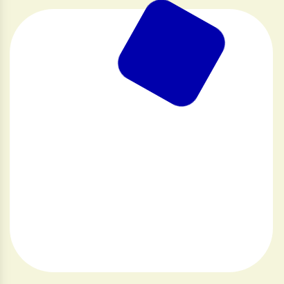

# UIB-interaction-animations-sliding-square

## Exercise: Animation

The HTML code defines a single `
` in the `<body>`. The existing CSS gives this `
` a size, a `background-color` and rounded corners. The `<body>` appears as a larger square with rounded corners.

The CSS file also contains an `@keyframes` at-rule named "square", which defines 5 keyframes: at `0%`, `25%`, `50%`, `75%` and `100%` (which brings the animation back to `0%`).

These keyframes currently have no properties or values associated with them.

## Instructions

Edit the keyframes so that the square will:
1. Rotate 90 degrees between every keyframe, passing through:
   * 90°
   * 180°
   * 270°
   * and 360°, which is the same rotation as 0°.
2. Moves along a square path:
   * First 200px down to the bottom left corner
   * Then 200px right along the bottom edge to the bottom right corner
   * Then 200px up the right edge to the top right corner
   * Finally 200px left along the top, back to its starting point.
3. Changes its `background-color` at each corner of the square:
   * Red in the bottom left
   * Green in the bottom right
   * Blue in the top right
   * Black in the top left

Instead of a single `animation` property in the rule with the `div` selector, use separate properties for the name, duration, number of iterations and the timing function.

